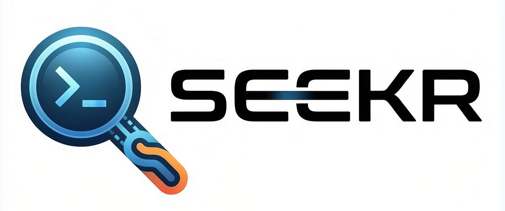

# seekr

<p align="center">
  
</p>

**seekr** is a high-performance AI Agent Manager featuring a sleek Terminal UI. While originally built as a DeepSeek-native client (and highly optimized for its reasoning models), seekr now features full OpenAI API integration, allowing you to use multiple models and providers. It brings the power of autonomous agents directly to your terminal with a robust toolset for shell execution, file management, and web exploration.


---

## 🌟 Highlights

- **Interruptible Agent Loop:** Real-time user steering. Interrupt the agent mid-thought to provide new context or directions.
- **True Multi-Tool Parallelism:** Execute multiple independent tool calls (reading files, searching web, etc.) concurrently for 5-10x performance gains.
- **Premium TUI Experience:** Beautiful, icon-based headers and a custom-built, wrapping-aware scrolling engine for a smooth conversation flow.
- **Dynamic Skills System:** Load and execute custom tools via simple JSON definitions and shell scripts (Python, JS, Bash, etc.).

## Features

- **Terminal UI (TUI):** Built with `ratatui` for a responsive, multi-tabbed interactive experience.
- **Multi-Model & OpenAI API Support:** Full support for configuring multiple LLM providers (OpenAI, DeepSeek, Local, etc.) via the standard OpenAPI format, while maintaining native optimizations for DeepSeek's reasoning models.
- **Extensible Skills System:** Refactored tool architecture allowing for global and repository-specific custom skills.
- **Autonomous Tools:**
  - **Shell:** Execute terminal commands with built-in sandboxing, timeouts, and **background execution**.
  - **File Edit:** Sophisticated file manipulation using patches and diffs.
  - **Web:** Real-time search and scraping.
  - **Task Management:** Goal planning and progress tracking.
- **Parallel Execution Engine:** Optimized batch processing of independent actions in a single turn.
- **Rich Activity Stream:** Real-time visibility into agent thoughts and tool executions with diff previews and parallel task numbering.
- **Session Persistence:** Automatic saving and loading of chat history and agent state.
- **Seekr Doctor:** Built-in diagnostics command to verify system health and API connectivity.

---

## 🛠️ TODO (Missing Features)

- [ ] **Syntax Highlighting:** Add full syntax highlighting for code blocks in the chat window.
- [ ] **Focus Actions:** Add context-aware option menus and interactive actions based on the current panel focus (Chat vs Tasks).
- [ ] **Advanced Thread Management:** Add a dedicated UI view for managing long-running background processes.
- [x] **Advanced Context Management:** Sliding-window and basic pruning for long-running conversations.
- [x] **Parallel Execution Engine:** Optimized batch processing of independent actions.

---

## ☣️ Danger Zone (Current Issues)

- ⚠️ **Large Result Lag:** Rendering extremely large tool outputs (1MB+) can cause temporary TUI stutter.
- ⚠️ **Resize Artifacts:** Rare layout flickering if the terminal is rapidly resized during an active API stream.

---

## Getting Started

### Prerequisites

- [Rust](https://www.rust-lang.org/tools/install) (latest stable version)
- An API Key for DeepSeek or any compatible OpenAPI-format provider (e.g., OpenAI, local LLMs).

### Installation

#### 📦 Binary Install (Linux x86_64)

The fastest way to get started is to download the pre-compiled binary from our [Latest Release](https://github.com/kodr-pro/seekr/releases/latest).

```bash
# Download the binary
curl -L -O https://github.com/kodr-pro/seekr/releases/download/v0.1.1/seekr-v0.1.1-linux-x86_64

# Make it executable and move to path
chmod +x seekr-v0.1.1-linux-x86_64
sudo mv seekr-v0.1.1-linux-x86_64 /usr/local/bin/seekr
```

#### 🛠️ Build from Source

If you prefer to build it yourself or are using a different architecture, ensure you have [Rust](https://www.rust-lang.org/tools/install) installed:

```bash
git clone https://github.com/kodr-pro/seekr.git
cd seekr
cargo install --path .
```

On your first run, **seekr** will guide you through a setup wizard to configure your first API provider and preferences.

---

## CLI Commands

| Command | Description |
| :--- | :--- |
| `seekr` | Launch the main TUI application. |
| `seekr doctor` | Run system diagnostics and health checks. |
| `seekr --resume <session_id>` | Resume a previous session by its ID. |

---

## ⌨️ TUI Shortcuts

| Key | Action |
| :--- | :--- |
| `Tab` | Switch focus between Chat and Tasks panel. |
| `Ctrl+S` | Open **Session List** (resume/delete previous chats). |
| `Ctrl+R` | Toggle visibility of agent reasoning tokens. |
| `Ctrl+L` | Clear the current chat history. |
| `F1` | Show the help / shortcut guide. |
| `PageUp/Dn`| Scroll chat or tasks quickly. |
| `Esc`/`Ctrl+C` | Quit the application. |

---

## Skills & Extensibility

**seekr** features a dynamic skills system. It loads tools from:
1. **Bundled Core Skills:** Essential file, shell, and task tools.
2. **Global Skills:** Located in `~/.config/seekr/skills/`.
3. **Local Skills:** Located in `./.seekr/skills/` within your current working directory.

Each skill is a directory containing a `skill.json` definition and any necessary scripts (Python, Shell, etc.).

---

## Configuration

**seekr** stores its configuration in `~/.config/seekr/config.toml`. You can manually edit this file or use the built-in setup wizard.

```toml
[[providers]]
name = "DeepSeek"
key = "your-api-key-here"
model = "deepseek-chat"
base_url = "https://api.deepseek.com"

active_provider = 0

[agent]
max_iterations = 25
auto_approve_tools = false
working_directory = "."

[ui]
theme = "dark"
show_reasoning = true
```

---

## Documentation

For more detailed guides and API references, check out our [Documentation](https://docs.page/kodr-pro/seekr).

---

## Contributing

Contributions are welcome! Please feel free to submit a Pull Request.

1. Fork the Project
2. Create your Feature Branch (`git checkout -b feature/AmazingFeature`)
3. Commit your Changes (`git commit -m 'Add some AmazingFeature'`)
4. Push to the Branch (`git push origin feature/AmazingFeature`)
5. Open a Pull Request

---

## License

Distributed under the Polyform Prosperity License 1.0.0. See `LICENSE` for more information regarding personal and commercial use.

---

<p align="center">
  Built with care by <a href="https://kodr.pro">kodr</a>
</p>
