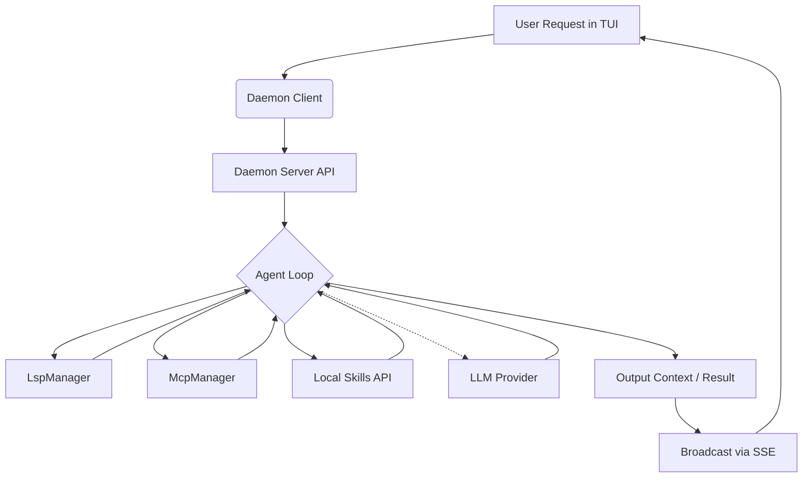

# Architecture

Seekr's architecture is designed around several decoupled components which allow for powerful agent-level workflows isolated from UI concerns and robust asynchronous process orchestration.

## Component Breakdown

1. **System Operator (Agent Loop)**
   - Encapsulated inside `AgentLoop`, the core cognitive engine is capable of recursive problem-solving, context management, and utilizing a broad array of localized skills and external tools.
   
2. **SeekrManager**
   - The central orchestrator that manages shared state (`LspManager`, `McpManager`, `SkillRegistry`) across frontend interfaces and background daemon topologies.

3. **Daemon Services**
   - Headless background execution is facilitated by an Axum-powered web server that pipes state, lifecycle events, and telemetry outputs to frontend consumers using standard Server-Sent Events (SSE).

4. **Extensible Protocols**
   - **Language Server Protocol (LSP)**: Advanced filesystem contextual grounding through `seekr::lsp::client`.
   - **Model Context Protocol (MCP)**: Expansive capability delegation to local or remote servers via `seekr::mcp::manager` that unifies external tools, resources, and templates.

5. **Terminal UI (TUI)**
   - The primary command center built iteratively upon `ratatui`.

## Flow of Execution

